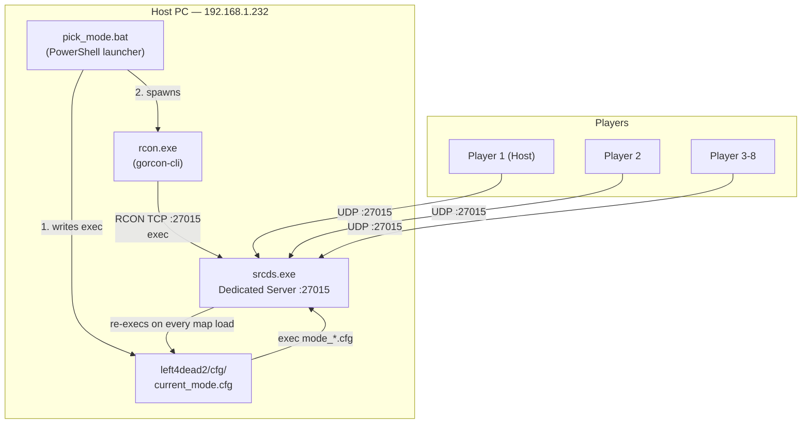
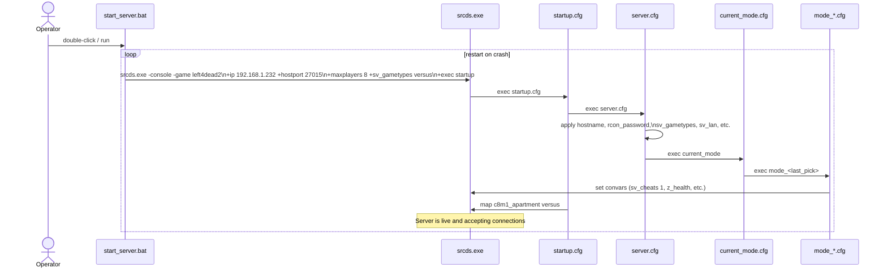
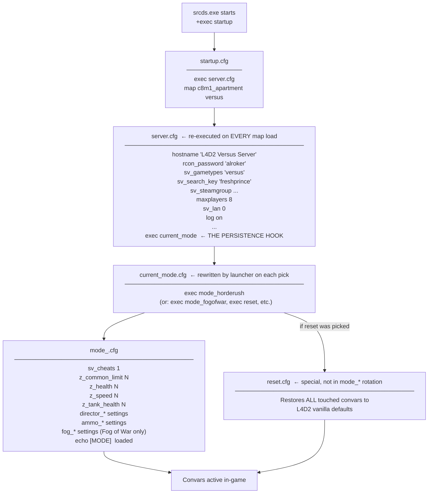
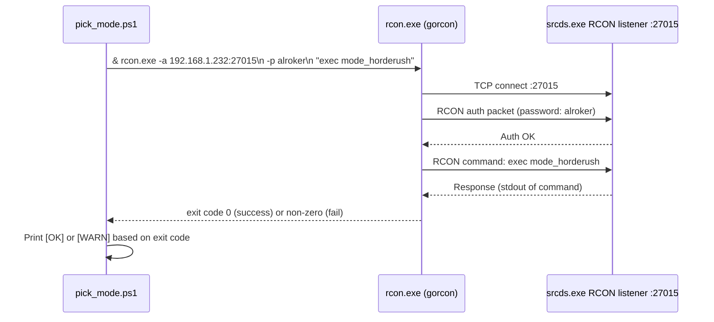
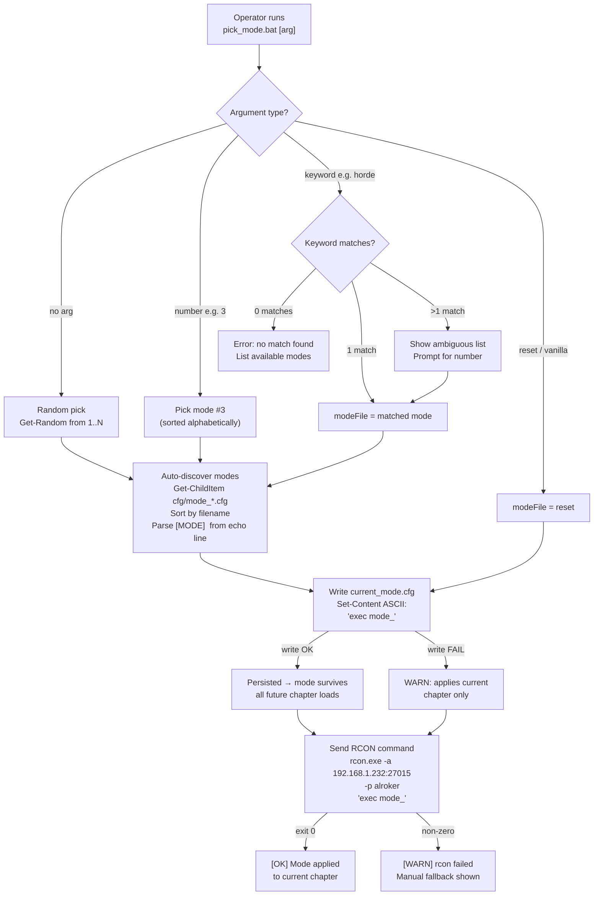
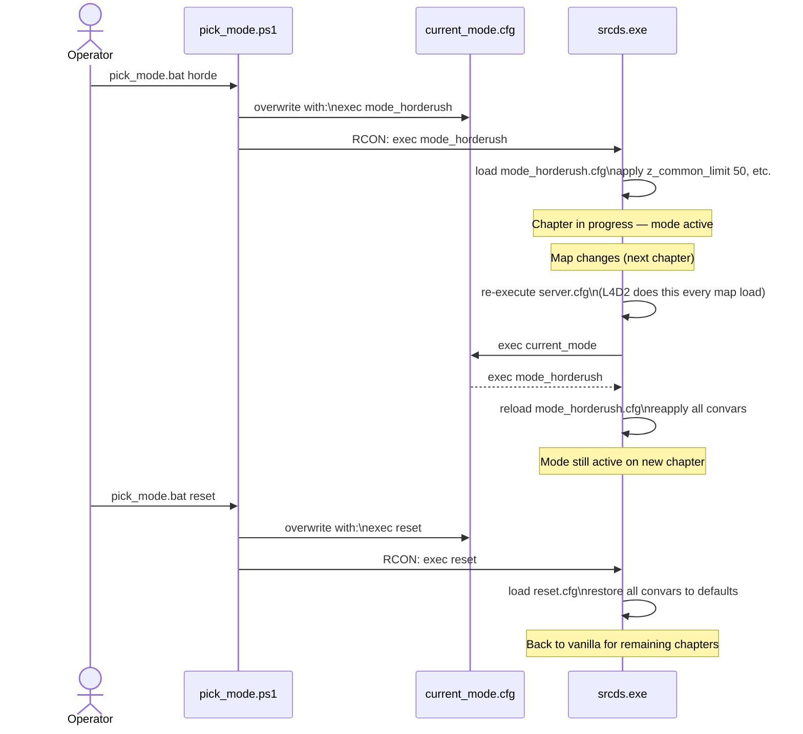
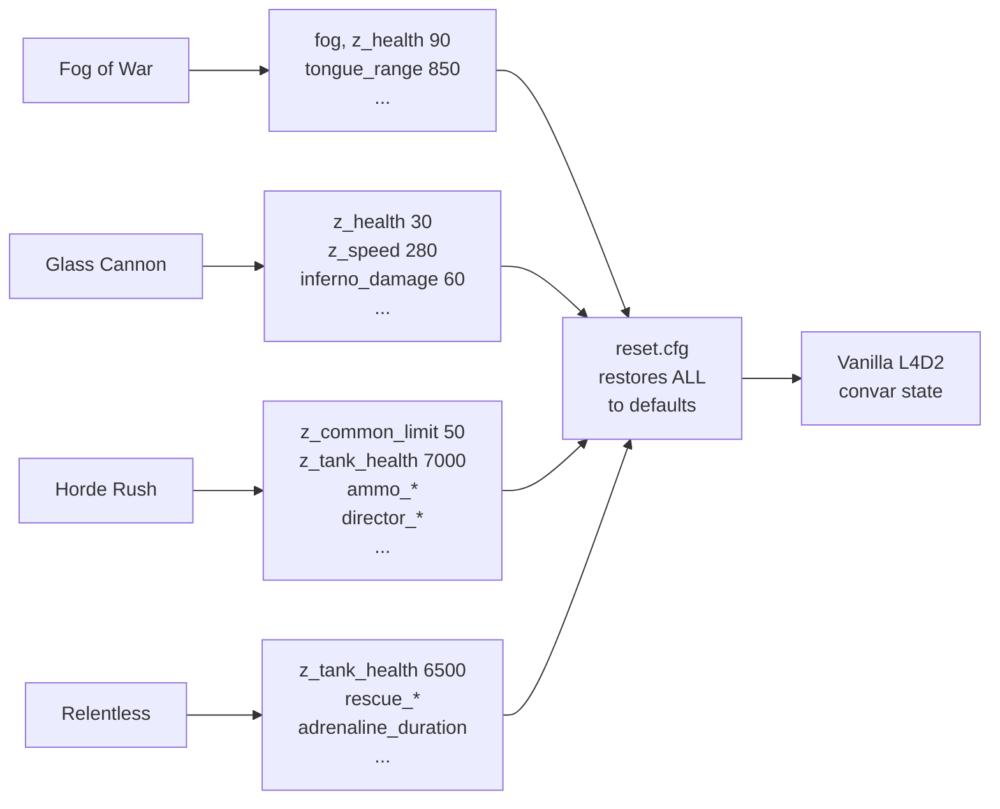
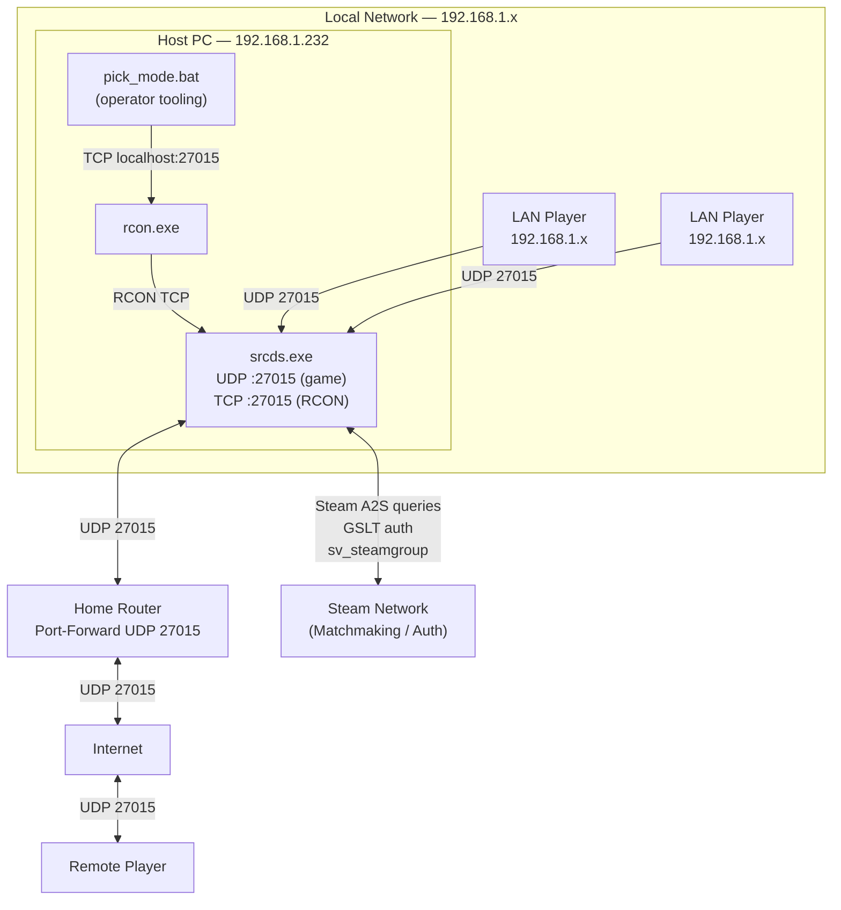
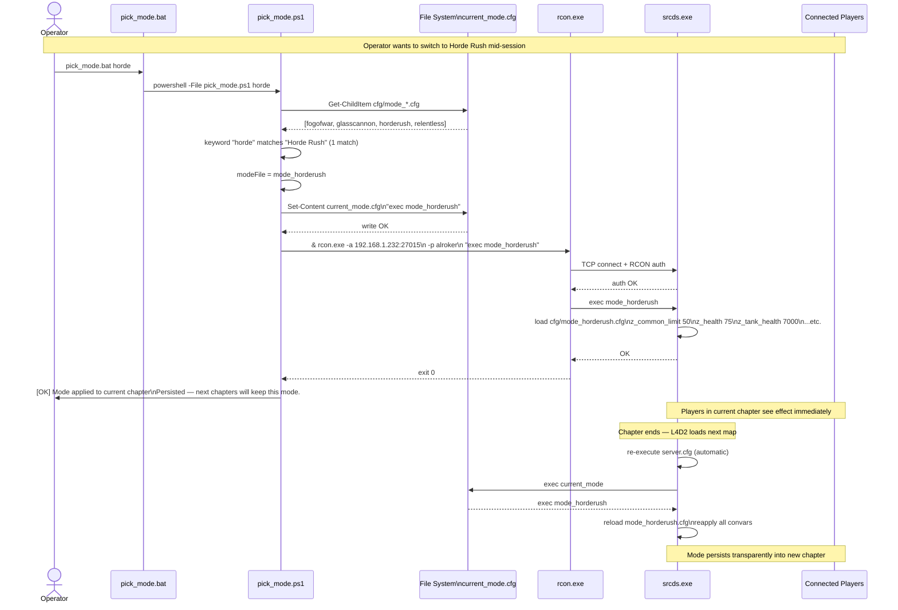

# L4D2 Private Server — End-to-End Architecture

> Complete system reference: server startup, RCON pipeline, mode execution, and persistence.

---

## Table of Contents

1. [System Overview](#1-system-overview)
2. [Directory Layout](#2-directory-layout)
3. [Server Startup Sequence](#3-server-startup-sequence)
4. [Config Chain](#4-config-chain)
5. [RCON Layer](#5-rcon-layer)
6. [Mode Execution Pipeline](#6-mode-execution-pipeline)
7. [Mode Persistence Mechanism](#7-mode-persistence-mechanism)
8. [Execution Modes Reference](#8-execution-modes-reference)
9. [Network Topology](#9-network-topology)
10. [End-to-End Request Flow](#10-end-to-end-request-flow)
11. [SourceMod Layer](#11-sourcemod-layer)

---

## 1. System Overview

A single Windows machine runs both the dedicated game server and the operator tooling. Players connect over LAN (or internet via port-forward). The operator switches game modes at runtime via a PowerShell launcher that writes a config file and sends an RCON command simultaneously.



---

## 2. Directory Layout

```
C:\L4D2\
├── srcds.exe                        # Source dedicated server binary
├── left4dead2.exe                   # Game client binary
├── start_server.bat                 # Server launcher (infinite restart loop)
├── steam_appid.txt                  # App ID 550 (L4D2)
│
├── left4dead2\                      # Game content directory
│   ├── cfg\                         # ← All runtime config lives here
│   │   ├── server.cfg               # Core server settings; execs current_mode
│   │   ├── startup.cfg              # Runs on srcds start: execs server.cfg, loads map
│   │   ├── current_mode.cfg         # Pointer to active mode (rewritten by launcher)
│   │   ├── reset.cfg                # Vanilla convar restore (not in mode rotation)
│   │   ├── mode_fogofwar.cfg        # Custom mode
│   │   ├── mode_glasscannon.cfg     # Custom mode
│   │   ├── mode_horderush.cfg       # Custom mode
│   │   ├── mode_relentless.cfg      # Custom mode
│   │   └── sourcemod\               # SourceMod plugin configs
│   │
│   ├── addons\
│   │   ├── metamod.vdf              # MetaMod:Source loader
│   │   └── sourcemod\               # SourceMod installation
│   │       ├── plugins\             # Installed .smx plugins
│   │       └── extensions\          # Native extensions (.ext.dll)
│   │
│   ├── mapcycle.txt                 # Map rotation
│   ├── missioncycle.txt             # Campaign rotation
│   ├── motd.txt                     # Plain-text message of the day
│   └── logs\                        # Server logs
│
├── versus_modes\                    # Operator tooling (lives outside server tree)
│   ├── pick_mode.bat                # Entry point (bat wrapper → PowerShell)
│   ├── pick_mode.ps1                # Mode picker logic
│   └── rcon.exe                     # gorcon-cli binary
│
└── steamapps\                       # Steam content cache
```

---

## 3. Server Startup Sequence

`start_server.bat` runs `srcds.exe` in an infinite loop so the server auto-restarts on crash.



**Start command breakdown:**

| Flag | Value | Purpose |
|------|-------|---------|
| `-console` | — | Attach interactive console window |
| `-game` | `left4dead2` | Select game directory |
| `+ip` | `192.168.1.232` | Bind to LAN interface |
| `+hostport` | `27015` | UDP game port (also RCON TCP) |
| `+maxplayers` | `8` | 4 survivors + 4 infected |
| `+sv_gametypes` | `versus` | Start in Versus mode |
| `+exec` | `startup` | Run `cfg/startup.cfg` on load |

---

## 4. Config Chain

Every map load re-executes the full chain from `server.cfg` downward. This is what makes mode persistence work — cheat-protected convars reset on each map load, but the chain immediately re-applies them.



---

## 5. RCON Layer

RCON (Remote CONsole) is a TCP protocol that lets the launcher send console commands to the running server without touching the server window.



**RCON configuration:**

| Setting | Value | Where set |
|---------|-------|-----------|
| Password | `alroker` | `server.cfg` → `rcon_password "alroker"` |
| Address | `192.168.1.232:27015` | `pick_mode.ps1` → `$SERVER_IP` / `$SERVER_PORT` |
| Client binary | `rcon.exe` | `versus_modes/rcon.exe` (gorcon-cli) |

The RCON password in `server.cfg` and `$RCON_PASSWORD` in `pick_mode.ps1` must match exactly.

---

## 6. Mode Execution Pipeline

The full lifecycle when an operator picks a mode:



**Mode discovery logic** — the launcher never has a hardcoded mode list. At runtime:
1. Glob `cfg/mode_*.cfg` — sorted alphabetically → assigns display numbers.
2. Parse each file for `echo [MODE] <Name> loaded` → display name and keyword.
3. Files named `reset.cfg` / `current_mode.cfg` are excluded by the glob pattern itself.

---

## 7. Mode Persistence Mechanism

L4D2 resets cheat-protected convars (`FCVAR_CHEAT`) on every map load. The persistence trick bypasses this without any plugin.



**Why `sv_cheats 1` must stay on:**
All custom convar overrides use `FCVAR_CHEAT`-flagged cvars. Turning `sv_cheats 0` inside a mode cfg would immediately invalidate all the values that were just set. All mode cfgs set `sv_cheats 1` and leave it on.

---

## 8. Execution Modes Reference

### Mode: Fog of War (`mode_fogofwar.cfg`)

Heavy visibility penalty. Fewer but tougher commons. Specials gain range and damage.

| Category | Key Changes vs Vanilla |
|----------|----------------------|
| Visibility | `fog_start 64`, `fog_end 600`, `fog_maxdensity 0.9`, color `20 20 25` |
| Commons | limit 18 (↓ from 30), HP 90 (↑), speed 240 |
| Specials | Smoker tongue 850 (↑), Hunter pounce 7dmg (↑), Boomer vomit delay 1.5s (↓) |
| Tank | 6000 HP (vanilla) |
| Survivors | No ammo bonus — fog IS the penalty |
| Best on | Swamp Fever, Hard Rain, Death Toll |

### Mode: Glass Cannon (`mode_glasscannon.cfg`)

Everything hits harder, everything dies faster. Positioning punished severely.

| Category | Key Changes vs Vanilla |
|----------|----------------------|
| Commons | limit 35 (↑), HP 30 (↓), speed 280 (↑) |
| Specials | Tank 4000 HP (↓), Smoker choke 15/tick (↑), Hunter pounce 8/tick (↑) |
| Survivors | Fire damage 60/s (↑ from 40), more pills + adrenaline |
| Director | Fog disabled |
| Best on | The Parish, Dead Center, No Mercy |

### Mode: Horde Rush (`mode_horderush.cfg`)

Overwhelming numbers. Survivors compensated with expanded ammo and throwables.

| Category | Key Changes vs Vanilla |
|----------|----------------------|
| Commons | limit 50 (↑↑), HP 75 (↑), speed 290 (↑), mob size 70 (↑) |
| Specials | Tank 7000 HP (↑), frustration timer 30s (↑) |
| Survivor Ammo | Rifle 500, Shotgun 100, SMG 750, Sniper 200 |
| Director | Pills ×8, pipe bombs ×5, molotovs ×5, bile jars ×4 |
| Best on | Any campaign |

### Mode: Relentless (`mode_relentless.cfg`)

Constant pressure + beefier Tank. Survivors get premium gear and faster rescues.

| Category | Key Changes vs Vanilla |
|----------|----------------------|
| Commons | limit 35, HP 50 (vanilla), speed 250 (vanilla) |
| Specials | Tank 6500 HP (↑), tongue 800 (↑), Hunter pounce 6/tick (↑) |
| Survivor Ammo | Rifle 500, Shotgun 100, SMG 750 |
| Director | Pills ×9, pipe bombs ×6, molotovs ×6, bile ×5 |
| Rescue | min dead time 30s (↓ from 60), distance 3000 (↓ from 4500) |
| Adrenaline | Duration 18s (↑ from 15s) |
| Best on | Dark Carnival, The Parish, Blood Harvest |

### Reset (`reset.cfg`)

Not a mode. Restores every convar touched by any mode back to L4D2 vanilla defaults and clears `current_mode.cfg` so subsequent chapters stay vanilla.



---

## 9. Network Topology



**Connection methods for players:**

| Method | Command | Requires |
|--------|---------|----------|
| Direct connect (LAN) | `connect 192.168.1.232:27015` | `sv_lan 0` or `sv_lan 1` |
| Direct connect (internet) | `connect <public-ip>:27015` | Port-forward UDP 27015, `sv_lan 0` |
| Lobby force (LAN) | `mm_dedicated_force_servers 192.168.1.232:27015` | All players set before lobby start |
| Steam search key | `sv_search_key freshprince` | All players set same key |

---

## 10. End-to-End Request Flow

Full trace from operator decision to convars active on server across chapter transitions.



---

## 11. SourceMod Layer

MetaMod:Source + SourceMod are installed but only stock plugins are active. No custom L4D2 plugins are currently installed.

```mermaid
graph TD
    SRCDS_SM["srcds.exe"] --> MM["MetaMod:Source\naddons/metamod.vdf\naddons/metamod_x64.vdf"]
    MM --> SM["SourceMod\naddons/sourcemod/"]

    SM --> PLUGINS["Active Plugins (.smx)\n─────────────────────\nadmin-flatfile\nadminhelp / adminmenu\nbasecommands / basebans\nbasechat / basecomm\nbasetriggers / basevotes\nclientprefs\nfuncommands / funvotes\nnextmap\nplayercommands\nreservedslots\nsounds\nantiflood"]

    SM --> EXT["Extensions (.ext.dll)\n─────────────────────\nbintools\nclientprefs\ndbi.sqlite\ndhooks\ngeoip\nregex\nsdkhooks\ntopmenus\n..."]

    SM --> SMCFG["SourceMod Configs\ncfg/sourcemod/\n─────────────────\nsourcemod.cfg\nbasevotes.cfg\nfuncommands.cfg\nsm_warmode_off/on.cfg"]

    PENDING["Pending (not yet installed)\n─────────────────────────\nTeam Manager (team switching)\nScore/Team Manager\nCampaign/Map Voter\nVote Manager 3"]

    style PENDING fill:#4a3300,stroke:#aa7700
```



**SourceMod admin access:** Managed via `addons/sourcemod/configs/admins_simple.ini` (flat-file auth). In-game admin commands available via chat prefix `sm_` or console `sm_*`.

---

## Quick Reference

```
Start server:     double-click start_server.bat  (auto-restarts on crash)

Pick a mode:
  pick_mode.bat              → random mode
  pick_mode.bat 3            → mode #3 (sorted: fogofwar=1, glasscannon=2, horderush=3, relentless=4)
  pick_mode.bat horde        → keyword match
  pick_mode.bat reset        → vanilla restore + clear persistence

RCON direct:
  rcon.exe -a 192.168.1.232:27015 -p alroker "exec mode_horderush"
  rcon.exe -a 192.168.1.232:27015 -p alroker "z_common_limit"    (query a cvar)
  rcon.exe -a 192.168.1.232:27015 -p alroker "status"

Add a mode:       drop cfg/mode_<name>.cfg into left4dead2\cfg\
                  include line: echo [MODE] <Display Name> loaded - <desc>
                  launcher auto-discovers it on next run

Config chain:     srcds +exec startup → startup.cfg → server.cfg
                  → exec current_mode → mode_*.cfg  (re-runs every map load)

Ports:            UDP 27015  game traffic
                  TCP 27015  RCON
```
